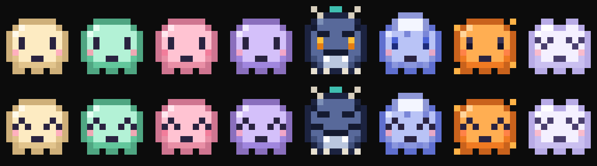

# terminal-pets

A tiny pixel-art pet for your PowerShell terminal. It greets you with a bounce and a blink when you open a new window, and it can bob around your screen whenever you want some company.

The pets are Mote and friends from the upcoming Kuni app.



## Install

1. Download this repo: **Code → Download ZIP**, then unzip it somewhere permanent. You can also clone it:
   ```powershell
   git clone https://github.com/gordoperoguapo/terminal-pets
   ```
2. In PowerShell, go to that folder and run the installer:
   ```powershell
   cd terminal-pets
   .\install.ps1
   ```
   If PowerShell says running scripts is disabled, run this instead:
   ```powershell
   powershell -ExecutionPolicy Bypass -File .\install.ps1
   ```
3. Open a new PowerShell window.

The installer adds one line to your PowerShell profile that loads `pet.ps1` from this folder, so leave the folder where it is. Windows PowerShell 5.1 and PowerShell 7 keep separate profiles, so run the installer in each one you use.

## Use

| Command | What it does |
|---|---|
| `pet` | Your pet bobs around the terminal. Press any key to stop. |
| `pet -Skin Ember` | Same, with a different skin just this once |
| `pet -Speed 60` | Faster (milliseconds per frame, default 110) |
| `Get-PetSkin` | List the skins |
| `Set-PetSkin Rumble` | Switch skins. Your choice is remembered. |
| `Show-PetBanner` | Show the welcome banner again |

To keep the commands but skip the banner when PowerShell starts, add `$PetBanner = $false` to your profile above the terminal-pets line.

## Skins

| Skin | |
|---|---|
| Mote | the original |
| Mint, Pink, Lavender | Mote in other colors |
| Rumble | a tough little kaiju |
| Drizzle | a little rain cloud |
| Ember | a cozy flame |
| Puff | a sleepy cloud |

## Requirements

- Windows PowerShell 5.1 or PowerShell 7
- A terminal with true-color support, such as Windows Terminal or the VS Code terminal

## Uninstall

```powershell
.\uninstall.ps1
```

This removes the terminal-pets line from your profile and leaves everything else alone. Then you can delete the folder.

## License

The code is MIT licensed. Mote and the other character designs are not; see [LICENSE](LICENSE).
